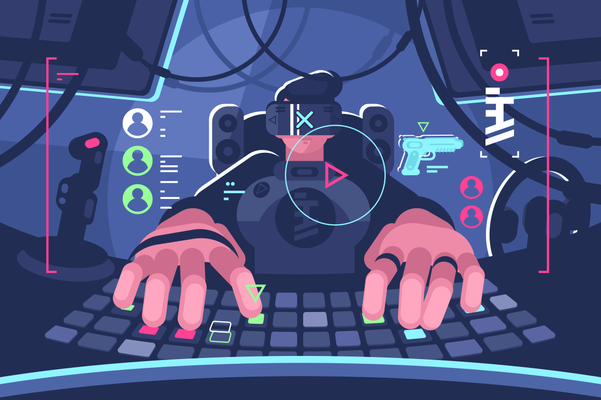

Ever since I was a kid, I loved played video games. I enjoyed seeing how they work and it always made me wonder how everything was put together. This interest really made me want to learn how to code and how to create my own games. Everyone starts off somewhere, and that somewhere for me started not too long ago by coding in Java. It started by learning how Java works and eventually building up to the point where I can make a simple game with relative ease. However, I stopped coding in Java and started to learn C and C++ for another class.

C and C++ are languages that I think people should learn in order to develop solid fundamentals. The language requires you to do most of the functions yourself which helped me in understanding pseudocoding and designing the code in such a way that it won't leak memory or cause errors. I believe that learning both C and C++ helped me immensely in terms of software engineering and towards my eventual goal of making a full on game.

Throughout this dive through the deep ocean that is programming, I hope to be able to develop the right skills in order to success as a software engineer. Learning more languages and being able to think outside the box to problem solve are things that I think is very crucial for me to learn. Not only that, but communicating between people is a necessity for being able to work with others.

