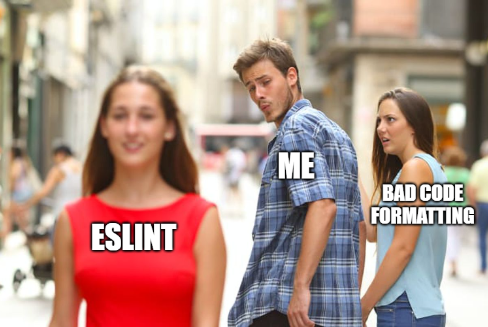

## What is ESLint?

Everyone has to abide by some coding standard whether or not they're coding for themselves or for an assignment. For example, in ICS 314, we use a coding standard called ESLint with IntelliJ for Javascript. ESLint has a whole [page](https://eslint.org/docs/rules/) listing out the rules that they have set up. However, we don't have to sit there and read through every single one. It will automatically check for us whether there's an error with the code style, typos, missing curly braces, and much more. The best part is when there are no errors or typos in our code, in which case it will give us a green checkmark in the top right corner of IntelliJ. 

## The Green Checkmark

This green checkmark indicates whether or not your code abides by ESLint's coding standards. It's a good feeling whenever you're finished coding and you see the green checkmark in the top right corner. Having code in a uniform and neat manner is cruicial to being able to read and understand it quickly. Also, having that near instantanous feedback on missing curly braces and variable usages is quite useful as I forget to put a semicolon or curly brace sometimes. 

## The One Annoyance

However, ESLint can be a little annoying at times. For example, as soon as you make a new function with no contents inside of it, it will give an error with red lines underneath indicating the error. Sometimes I think ESLint wants me to rush to finish the function so that there's no error there. Honestly though, ESLint has many positive aspects with it that overshine this small thing that I find annoying and it makes formatting code much easier.

