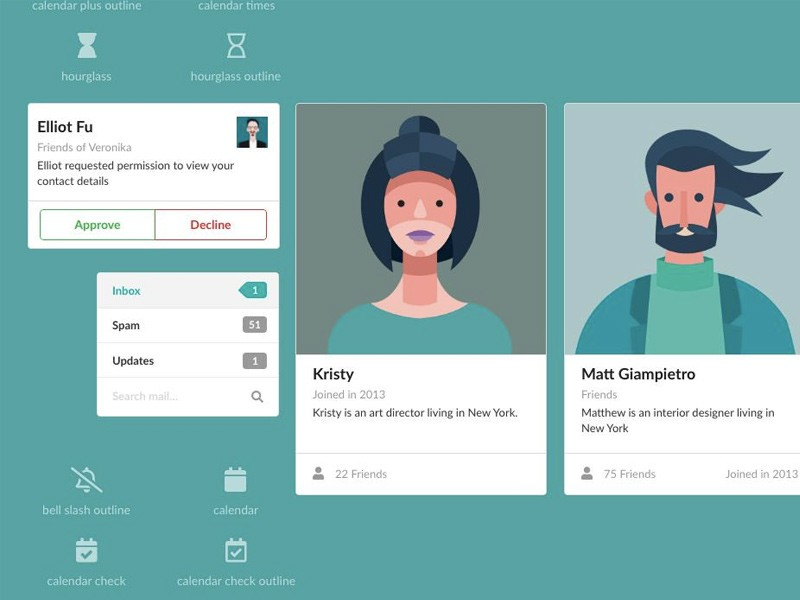
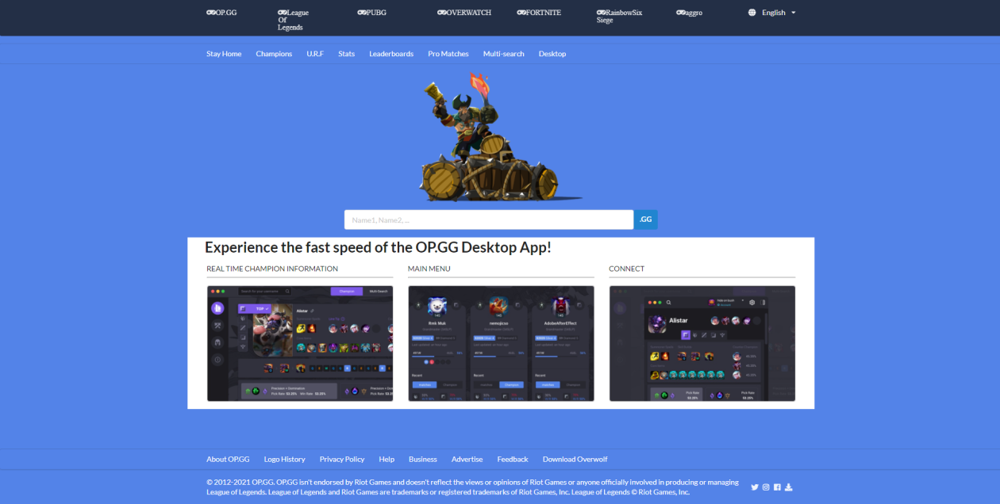

## Starting With the Basics

Making a website can be a lot harder than people think it is. My first introduction to making simple websites was with only HTML and CSS. While HTML and CSS are good and very good and easy to pick up, the kinds of design and creative things you can do with it is limited. Your website will look like the reincarnation of MySpace and while that's not a bad thing, it's not the most appealing thing to look at.

## Semantic Antics

In order to make better looking websites, I used Semantic UI. It was a part of the frameworks that I used for ICS 314. Semantic UI looks daunting at a glance but in reality, is much simpler. The language used it very basic and it what you would normally describe a button or menu like. Some examples include: "large red button", and "ui container." Semantic UI comes with a lot of premade icons which are very helpful in designing and making a website look pretty. Many websites online could be recreated to a certain degree very easily with Semantic UI. On the other hand, if someone were to recreate the same website using HTML and CSS only, I believe it would look worse without putting in a significant amount of effort. 

## So Why Bother?

Using frameworks such as Semantic UI is very helpful in learning how to create and design a website. Semantic UI is easy to pick up and create a nice looking website. Even if it doesn't look nice in the beginning, playing around with the wording and different implementations that Semantic UI has will help make the website look nicer. With the small amount of time that I have put into experimenting and making things with Semantic UI, I have made a recreation of a website that I frequently use. It doesn't look exactly the same. The website I made very obviously looks like a bootleg version of it, but I'm still proud of what it looks like because of the little experience that I had with Semantic UI.

