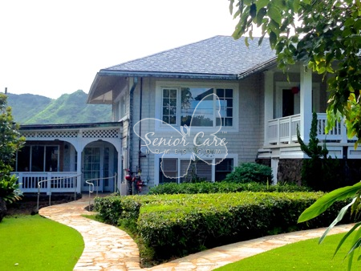

  

In my senior year of high school, I went out to volunteer at Caring Manoa for a project. Caring Manoa was able to let me volunteer and help out their staff with taking care of the elderly. I was to help move things around the home and make sure that I was helping the staff with whatever they needed help with. Most of my day was moving around and doing physical labor for the staff. However, I did find it very helpful in developing my communication skills to work with others.

I had eventually noticed that my mindset began to change when I went to volunteer there. When it was time to help out, I separated all of my thoughts from the task and hand and focused completely on it. That way, I would be able to concentrate more on communicating with the staff and helping them. 

