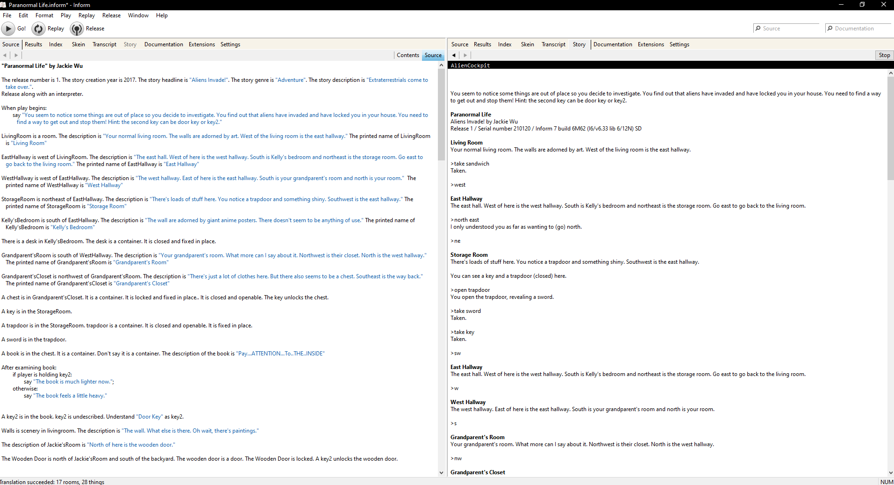

During high school, I took an intro class to computer science where they taught us very basic coding. For one of our first projects, we had to use Inform in order to make our own text based adventure game. Inform is a free computer program that lets you code in english sentences. The text based game that I made is called Paranormal Life and it is a science fiction adventure game that takes place in the main characters house. It is a very simple game but it was a lot of fun to make. 

I thought being able to code in this way was very unique and helped me understand a little bit more behind the logic of computer programming. Although this program made making this type of game very basic and easy, I still thought that working with this program and using github to save and commit the work was very helpful. The github that I commited the program to is [here](https://github.com/Fyrien/Paranormal-Life).

